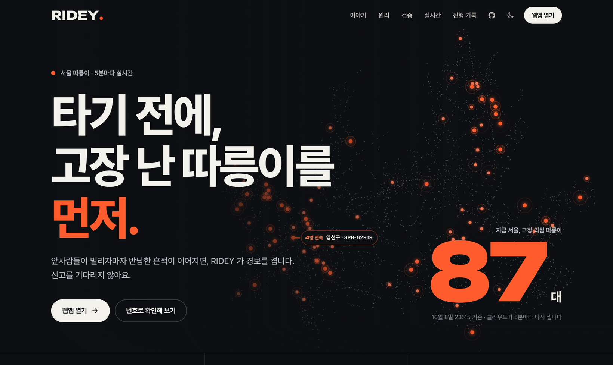
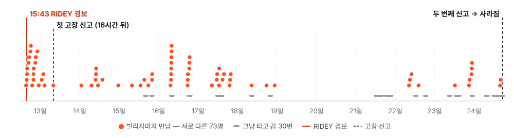
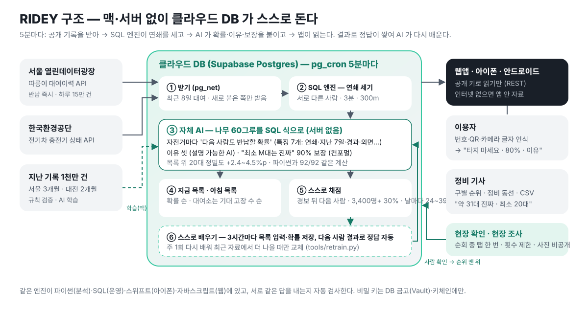
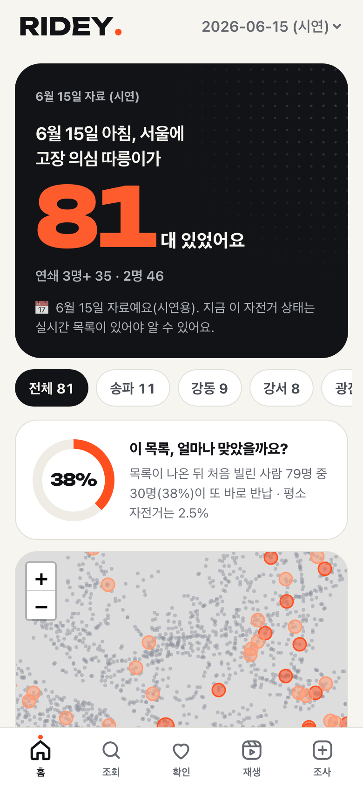
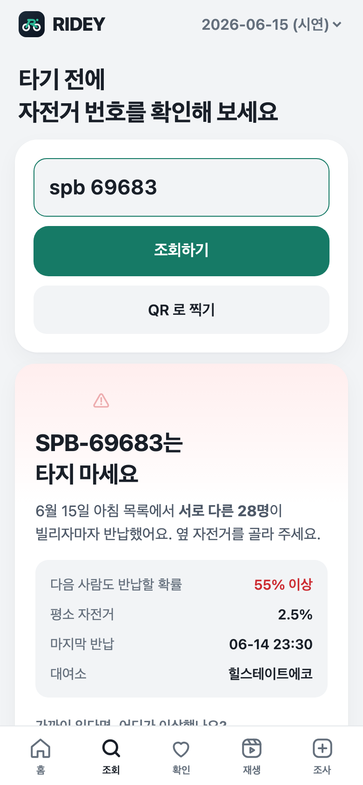
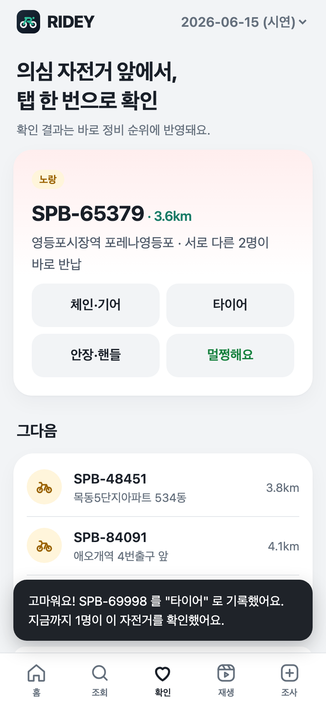
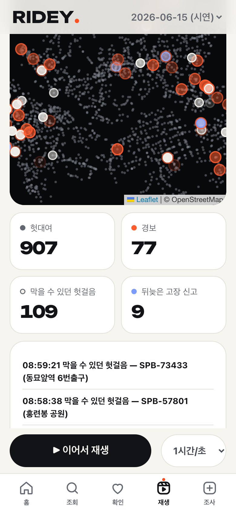

<p align="center"></p>
<h1 align="center">RIDEY</h1>

<p align="center"><b><i>Ready before you ride.</i></b><br>타기 전에, 고장 난 따릉이를 먼저 알려 줄게요.</p>

<p align="center">
  <a href="https://zmflm0110.github.io/ridey/"></a>
  <a href="https://zmflm0110.github.io/ridey/app/"></a>
  <a href="https://github.com/zmflm0110/ridey/actions/workflows/test.yml"></a>
  <a href="https://github.com/zmflm0110/ridey/actions/workflows/ios.yml"></a>
  <a href="LICENSE"></a>
</p>

<p align="center">
  <a href="https://zmflm0110.github.io/ridey/">웹사이트</a> ·
  <a href="https://zmflm0110.github.io/ridey/app/">웹앱 써 보기</a> ·
  <a href="docs/report.pdf">보고서</a> ·
  <a href="docs/slides.pdf">발표</a> ·
  <a href="docs/demo/demo.mp4">시연 영상</a> ·
  <a href="CHANGELOG.md">진행 기록</a>
</p>

<p align="center">
  <a href="https://zmflm0110.github.io/ridey/"></a>
</p>

> **사람들은 고장 신고는 안 하지만, '빌리자마자 반납' 으로 이미 신고하고 있었다.**
> RIDEY 는 공개된 대여 기록에서 그 흔적을 읽어, 고장 난 따릉이를 신고보다 하루 먼저 찾는다.

---

## 이 자전거는 12일 동안 73명을 돌려보냈다

<picture>
  <source media="(prefers-color-scheme: dark)" srcset="docs/img/spb69683-dark.svg">
  
</picture>

서울 강서구의 실제 자전거 **SPB-69683** (2026년 6월 대여 기록·고장 신고 그대로, [`analysis/spb69683.py`](analysis/spb69683.py))

- **6월 12일 15:20** 첫 사람이 빌리자마자 같은 대여소에 반납. **15:43** 두 번째 사람도 — RIDEY 라면 이때 경보.
- **6월 13일 07:58** 첫 고장 신고. 그런데도 그 뒤 **54번** 더 빌렸다가 바로 반납됐다.
- **6월 16일 07:13\~07:50** 출근길 37분 사이 7명이 연달아.
- **6월 24일** 두 번째 신고 뒤에야 사라졌다. 그사이 **서로 다른 73명**.

## 왜 아무도 몰랐나

| 벽 | 숫자 | 근거 |
|---|---|---|
| **신고는 귀찮다** | 연달아 포기된 자전거의 **49\~61%** 는 7일이 지나도 신고 없음 | [보고서 5-3](docs/report.md) |
| **눈으로는 안 보인다** | 공단은 하루 한 번 넘게 대여소를 돌며 수거의 절반을 신고 없이 찾지만, 경보가 울린 자전거의 **82\~91%** 는 하루 안에 또 빌려진다 — 체인·브레이크처럼 타 봐야 아는 고장 | [공단 운영 조사](docs/operations.md) · [`after_alarm.py`](analysis/after_alarm.py) |
| 규모 | 고장 접수 2024년 **16만 건**, 운영 적자 127억 원 | [헤럴드경제](https://biz.heraldcorp.com/article/10878875) |

## 규칙 하나

| | |
|---|---|
| **헛대여** | 같은 대여소에 **3분** 안에, **300m** 도 안 가고 반납 — 타 보려다 포기한 흔적 |
| **서로 다른 사람** | 한 사람이 다시 해 본 건 한 번으로 센다 (생년·성별, 없으면 '반납 2분 안 재대여') |
| **경보** | 서로 다른 사람이 **2명** 이어지면 노랑, **3명** 이면 빨강 |
| **끝** | 누군가 정상으로 타고 가면 끝 |

기준은 **2026년 1월 기록으로만** 정하고, 3·6월과 대전 타슈에는 손대지 않고 그대로 적용했다 ([phase1](docs/phase1.md)).

## 숫자로

<p align="center"></p>

| | 결과 | 근거 |
|---|---|---|
| 서로 다른 두 사람이 포기한 뒤 다음 사람도 | **35\~44%** 가 또 바로 반납 (평소 2.5% — 약 **14배**) | [results](docs/results.md) |
| 신고보다 빠름 | 경보 → 고장 신고 중앙값 **20\~25시간**, 그사이 한 대에서 평균 4명 헛걸음 | [보고서 5-3](docs/report.md) |
| 막을 수 있던 헛걸음 | 서울 하루 **90\~243명**, 대전 하루 114\~132명 | [보고서 5-2](docs/report.md) |
| 검증 규모 | 서울 3개월·대전 2개월, 약 **1천만 건** | [results](docs/results.md) |
| 정비 동선 | 근무 시간 안에 가장 많이 막는 순서 — 순위대로 돌기보다 **12\~17% 더** | [route_backtest](docs/route_backtest.md) |

## 지금도 돌고 있다

서울 대여이력 API 는 자전거별 기록을 **반납하자마자** 준다. 그래서 2026년 9월 27일부터 **클라우드 DB 가 5분마다 스스로** 받아서 세고, 앱은 어디서든 읽는다 — 서버도, 켜 둔 컴퓨터도 없다.

| 실제 운영 (10월 6일 기준) | |
|---|---|
| 경보 뒤 처음 빌린 다른 사람 | **3,033명 중 932명(31%)** 이 또 바로 반납 — 지난 기록으로 잰 32\~34% 와 같다 |
| 5분 작업 | 하루 288번 모두 성공, 한 번 평균 **22초** |
| 최신 숫자 | [웹사이트](https://zmflm0110.github.io/ridey/#live)가 5분마다 DB 에서 직접 |

<p align="center"></p>

## 자체 AI — 이길 때만 쓴다

규칙만으로도 된다. 그래서 규칙과 공정하게 겨뤄 **이긴 곳에만** 넣었다 ([model](docs/model.md)).

- 목록의 자전거마다 **"다음 사람도 바로 반납할 확률"** — 나무 60그루 모델(특징 7개: 연쇄·지난 7일·경과 시간·외면…)을 **SQL 식으로 바꿔 DB 안에서** 5분마다 계산
- 확률 순으로 보여 주니 **위 20대 중 진짜 고장이 세 달 모두 +2.4\~4.5%p**
- "이 중 **최소 M대는 진짜**" 를 90% 로 보장(분할 컨포멀) — 시험한 달에서 98\~100% 맞음
- 숫자만이 아니라 **이유를 사람 말로**: "서로 다른 12명이 연달아 반납 +36%p"
- **스스로 다시 배운다**: 3시간마다 표본, 다음 사람 결과로 정답 자동. 실시간 2,162개로 점검하니 지금 모델이 예측 34.0% · 실제 35.8% — 새로 배운 모델이 충분히 낫지 않아(로그 손실 −0.8%, 기준 −2%) **바꾸지 않았다** ([model_live](docs/model_live.md))
- 서울로만 배운 모델을 **대전에 그대로** 써도 위 10대 +4.5%p ([model_daejeon](docs/model_daejeon.md))

## 화면

<table>
  <tr>
    <td align="center"><br><b>정비 — 먼저 볼 곳</b><br><sub>구별 순위 · 동선 · CSV</sub></td>
    <td align="center"><br><b>이용자 — 빌리기 전</b><br><sub>번호·QR·카메라 → 경고와 이유</sub></td>
    <td align="center"><br><b>현장 확인</b><br><sub>의심 자전거 앞에서 탭 한 번</sub></td>
    <td align="center"><br><b>하루 재생</b><br><sub>신고보다 먼저 켜지는 경보</sub></td>
  </tr>
</table>

웹앱(홈 화면에 추가) · 아이폰 앱(SwiftUI, 카메라로 번호판 읽기) · 안드로이드 앱(APK) — 같은 화면, 같은 자료.

## 넓히기

| 어디 | 결과 |
|---|---|
| **대전 타슈** | 서울 기준을 그대로 — 두 명 포기 뒤 다음 사람 41.6\~43.6% (평소 2.9%) |
| **전기차 충전기** | 2026년 8월 권익위 '전기차 충전' 민원주의보(3년 새 1.8배). 앱엔 '사용 가능' 인데 안 되는 충전기를 같은 방법으로 — 연달아 두 번 바로 끊긴 충전기 188대 중 다음 충전도 **41.5%** (평소 2.7%, 약 15배). 사람을 구분할 수 없고 정답 자료가 없어 아직 가능성 ([ev_validation](docs/ev_validation.md)) |

## 어떻게 만들었나

| | |
|---|---|
| **엔진** | 파이썬(`engine/`) — 같은 규칙이 **SQL·스위프트·자바스크립트**에도 있고, 서로 같은 답을 내는지 자동 검사 |
| **운영** | Supabase Postgres — pg_cron(5분)·pg_net(서울 API)·SQL 로 연쇄·AI. 키는 DB 금고(Vault)·키체인에만 |
| **앱** | 웹(바닐라 JS·Leaflet, 오프라인 동작) · 아이폰(SwiftUI·VisionKit) · 안드로이드(Capacitor) |
| **검사** | 파이썬 35개 · 스위프트 16개 · 웹 화면 검사, 올릴 때마다 GitHub Actions |

**무료 DB 에서 버티기** — 10월 2일 밤, 무료 클라우드(메모리 0.5GB)가 6시간 멈췄다. 5분 작업이 한 번에 145MB 를 건드려 DB 캐시가 디스크로 밀려났기 때문. '헛대여가 둘 이상 이어져야 경보' 라는 필요조건으로 후보를 줄이고(답은 같음), 자전거별 기록을 덮개 색인에서 바로 읽게 다시 짰다 → **40MB · 한 번 22초**. 옛·새 SQL 이 같은 답인지는 로컬 Postgres 에 6월 기록을 흘려 넣으며 확인했다(36시간 73번 모두 같음, [`tools/live_sql_compare.py`](tools/live_sql_compare.py)).

## 한계

- **"고장" 정답이 없다.** 고장 신고는 늦고 드물어서, 다음 사람이 또 바로 반납했나를 정답으로 쓴다. 현장에서 직접 보는 조사를 준비했다([절차](docs/field_protocol.md)).
- **아무도 안 빌린 고장은 못 본다.** 흔적이 있어야 찾는다.
- **고장 종류는 못 맞힌다.** 평균으로는 단말기 고장이 더 빨리 반납되지만, 한 대씩 맞히면 10\~14% 뿐 — 종류는 현장에서 본다.

## 바로 해 보기

인증키 없이, 공개 자료만으로 모든 표를 다시 만든다.

```sh
python3 -m venv .venv && .venv/bin/pip install -r requirements.txt
.venv/bin/python data/download.py          # 원본 자료 (약 1.7GB)
.venv/bin/python analysis/report.py        # 핵심 표 → docs/results.md
.venv/bin/python server/app.py             # 웹앱 → http://localhost:8765
.venv/bin/python -m pytest -q tests        # 파이썬 테스트
```

<details>
<summary><b>클라우드 실시간 켜기</b> (Supabase · 서울 열린데이터광장 인증키)</summary>

키는 코드·git 에 넣지 않는다. 맥에서는 키체인(`-w` 로 끝내면 화면에 안 보이게 묻는다), 클라우드에서는 Supabase Vault.

```sh
security add-generic-password -a bike-doctor -s seoul-openapi -w      # 서울 열린데이터광장
security add-generic-password -a bike-doctor -s datagokr -w           # 공공데이터포털 (충전기, 선택)
security add-generic-password -a bike-doctor -s supabase-db -w        # Supabase DB 비밀번호
```

1. Supabase 프로젝트에 `supabase/schema.sql`(쓰기 표·권한) → `supabase/model.sql`(AI 식) → `supabase/live.sql`(5분 작업) → `supabase/ev.sql`(충전기, 선택) 순서로 적용.
2. Vault 에 `seoul_openapi`(·`datagokr`), 처음 채우기 `tools/supabase_live_load.py --stations --backfill 8`.
3. 앱의 공개(publishable) 키를 `web/cloud.js`·`ios/Core/Sources/HeotgeoleumCore/Cloud.swift` 에.

확인: `select at, ms from live.tick_log order by at desc limit 5` (단계별 ms·DB 크기). 파이썬과 같은 답인지 `tools/supabase_live_load.py --parity` · `--parity-model`.
충전기 기록은 클라우드에 3일만 남으니 3일 안에 `tools/ev_pull.py` → `analysis/ev_validate.py`. 실시간으로 AI 점검·다시 배우기는 `tools/retrain.py` (`--deploy` 는 나을 때만 바꿈).
</details>

<details>
<summary><b>안드로이드 · 아이폰</b></summary>

- **안드로이드(APK)**: 웹앱을 [Capacitor](https://capacitorjs.com) 로 감쌈(`android-app/`). `brew install openjdk@21 && brew install --cask android-commandlinetools` → SDK(`platforms;android-36`, `build-tools;36.0.0`) → `cd android-app && npm i && npm run apk`(디버그) 또는 `npm run release`(서명). 에뮬레이터 기능 시험 `tests/android/webview_e2e.js`.
- **아이폰 앱**: Xcode → `ios/HeotgeoleumZero.xcodeproj` → Team 고르고 ▶. 자세히는 [`ios/README.md`](ios/README.md).
- **아이폰 웹앱**: 사파리로 웹앱 주소 → 공유 → 홈 화면에 추가.
</details>

<details>
<summary><b>검사와 제출물 다시 만들기</b></summary>

```sh
npm i playwright marked
node tests/web/smoke.js                                                          # 웹앱 다섯 탭 휴대폰 화면 검사
PW_EXPERIMENTAL_SERVICE_WORKER_NETWORK_EVENTS=1 node tests/web/offline.js evict  # 진짜 오프라인 시연
SHOTS=docs/shots node tests/web/smoke.js                                         # 앱 화면 사진
node tests/web/record_demo.js                                                    # 시연 영상 (ffmpeg 필요)
node docs/build_pdf.js                                                           # 보고서·제안서·발표 PDF
.venv/bin/python tools/build_site.py                                             # 웹사이트
cd ios/Core && swift test                                                        # 스위프트 엔진
python tools/live_sql_compare.py --old <커밋>                                     # 클라우드 SQL 을 고칠 때: 옛·새 같은 답인지 (로컬 Postgres)
```
대회 제출 zip: `python tools/make_submission.py --id <학번> --name <이름>` (APK·소스·출처·영상·보고서·발표를 규칙대로 한 파일로).
</details>

## 폴더

| 폴더 | 내용 |
|---|---|
| [`engine/`](engine) | 헛대여·연쇄·경보 규칙(`core.py`), 아침 목록(`morning.py`), 충전기 헛충전(`ev.py`) |
| [`supabase/`](supabase) | 클라우드 5분 작업(`live.sql`), AI 식(`model.sql`), 충전기(`ev.sql`), 쓰기 표·권한(`schema.sql`) |
| [`analysis/`](analysis) | 검증 스크립트 — 기준 선택, 실시간 대조, AI 학습·비교, 공단 순회 효과, 그림 |
| [`web/`](web) | 웹앱 — 지금 목록·조회(QR)·현장 확인·하루 재생·현장 조사, 오프라인 동작 |
| [`ios/`](ios/README.md) | 아이폰 앱(SwiftUI) — 엔진 패키지 `Core/`, 화면 `App/` |
| [`android-app/`](android-app) | 안드로이드 앱(APK) — `web/` 을 Capacitor 로 감쌈 |
| [`site/`](site) | 작품 소개 웹사이트 (GitHub Pages) |
| [`docs/`](docs/README.md) | 보고서·발표·대본·결과 표·조사 — [문서 목록](docs/README.md) · [스토리라인](docs/story.md) |
| [`tools/`](tools) | 클라우드 적재·대조, SQL 비교, 다시 배우기, 제출물 만들기 |
| [`tests/`](tests) | 파이썬·웹 화면·오프라인·안드로이드 검사 |

자세한 측정과 실패 기록은 [`PLAN.md`](PLAN.md), 바뀐 점은 [`CHANGELOG.md`](CHANGELOG.md).

## 자료 · 참고

- **자료**: 서울 열린데이터광장 — 따릉이 대여이력([OA-15182](https://data.seoul.go.kr/dataList/OA-15182/F/1/datasetView.do), 실시간 API `tbCycleRentData`), 고장신고([OA-15644](https://data.seoul.go.kr/dataList/OA-15644/F/1/datasetView.do)), 대여소 정보 · 공공데이터포털 — 대전 타슈 대여이력, 한국환경공단 전기차 충전기 상태 (모두 공공누리 제1유형).
  앱과 공개 화면에는 이용자 정보(생년·성별)가 없다. 클라우드는 대여 기록을 8일만 둔다.
- **참고 연구**: Kaspi·Raviv·Tzur, [Detection of Unusable Bicycles in Bike-Sharing Systems](https://www.researchgate.net/publication/290496984_Detection_of_Unusable_Bicycles_in_Bike-Sharing_Systems) (Omega, 2016) · [Self-Supervised Transformer for Unusable Shared Bike Detection](https://arxiv.org/pdf/2505.00932) (2025) — 비교는 [related_work](docs/related_work.md).
- **포함한 라이브러리**: [Leaflet](https://leafletjs.com) 1.9.4 (BSD-2), [jsQR](https://github.com/cozmo/jsQR) 1.4.0 (Apache-2.0) — `web/vendor/` 에 라이선스 동봉. 지도 © OpenStreetMap 기여자. 글꼴 [Pretendard](https://github.com/orioncactus/pretendard) (OFL).
- **라이선스**: 코드는 [MIT](LICENSE). 자료는 각 출처의 공공누리 제1유형(출처 표시).

<p align="center"><b>신고를 기다리지 말고, 흔적을 읽자.</b></p>
