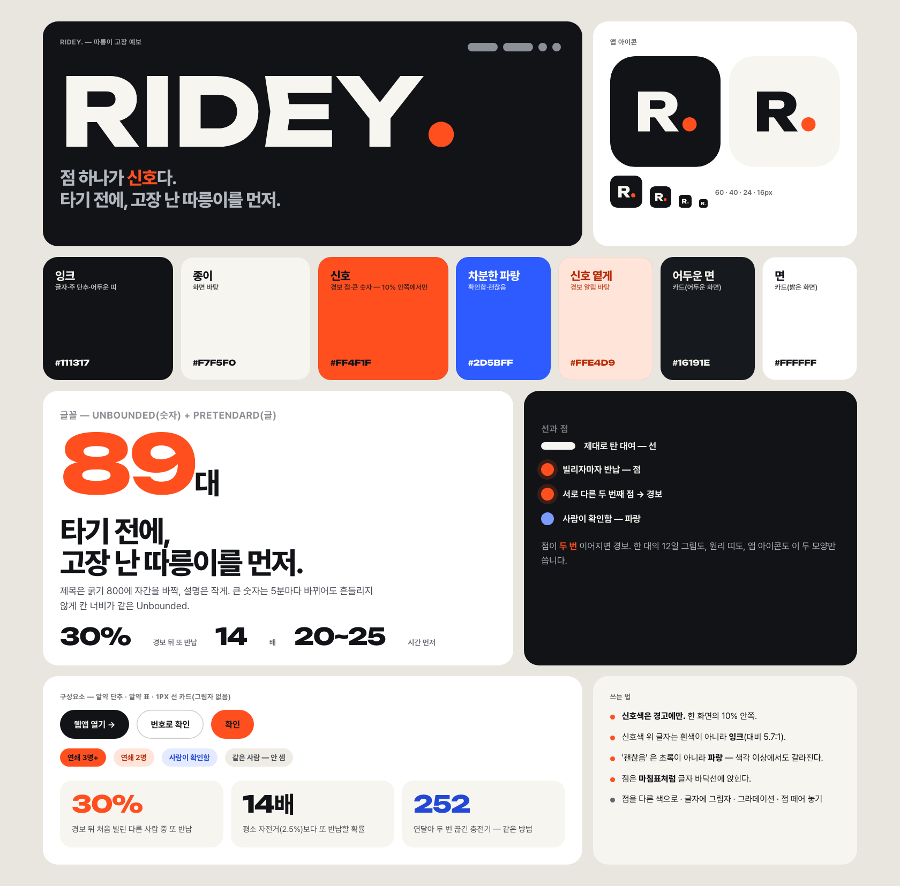

# RIDEY. 브랜드 (2026-10-08 새로)

> **점 하나가 신호다.** 제대로 탄 대여는 선, 빌리자마자 반납은 점. 서로 다른 두 사람의 점이 이어지면 경보.

## 1. 왜 바꿨나

처음 로고(자전거 모양 R + 민트 체크, 남색 글자)는 '착한 모빌리티 앱' 처럼 보였고 — 민트·남색은 어느 공유 서비스에나 있는 색 — 이 작품이 실제로 하는 일(**고장을 찾아 경고**)을 말해 주지 못했다. 게다가 초록은 '괜찮음', 빨강은 '경고' 라는 약속을 가지고 있어서, 민트가 브랜드색이면 '경보 화면' 이 브랜드와 싸웠다.

새 브랜드는 **경보 그 자체를 브랜드의 모양과 색으로** 삼는다.

| | 예전 | 새로 |
|---|---|---|
| 한 문장 | 앞사람들의 헛걸음이 고장을 알려 준다 | **점 하나가 신호다** · 타기 전에, 고장 난 따릉이를 먼저 |
| 모양 | 자전거 그림 + 글자 | 글자 `RIDEY` + **점**(마침표 = 신호) |
| 색 | 민트·남색(브랜드) + 빨강·노랑(경고) | **잉크·종이**(바탕) + **신호 주황**(경고 = 브랜드) + **차분한 파랑**(확인) |
| 숫자 | 일반 글꼴 | 넓고 둥근 **Unbounded**(숫자판처럼) |

## 2. 로고

- **워드마크 `RIDEY.`** — 글꼴 Unbounded(굵기 760, SIL OFL)를 도형으로 바꿨고, 마침표 자리의 점은 정확한 원으로 다시 놓아 신호색(#FF4F1F)을 칠했다. 점의 바닥은 글자 바닥선에 앉는다.
- **앱 아이콘 `R.`** — 잉크 바탕, 종이색 R, 신호 점. 16px 까지 읽힌다.
- 파일: `docs/brand/wordmark.svg` · `wordmark-dark.svg` · `wordmark-mono.svg`(점도 한 색) · `icon.svg` · `icon-light.svg`. 모두 `tools/make_brand.py` 가 코드로 만든다(글꼴 도형이라 글꼴 파일 없이 어디서나 같은 모양).
- **여백**: 점 지름의 2배. **최소 크기**: 워드마크 높이 14px, 아이콘 16px.
- **하지 말 것**: 점을 다른 색으로 · 글자에 그림자·그라데이션 · 글자 사이를 벌리기 · 점을 글자와 떼어 놓기 · 신호색 바탕 위에 신호색 점.

## 3. 색

색은 세 가지 일만 한다 — **바탕(잉크·종이)**, **경고(신호)**, **확인(차분한 파랑)**. 신호색은 한 화면의 10% 안쪽에서만, 그래서 보이면 눈이 간다.

| 이름 | 밝은 화면 | 어두운 화면 | 쓰는 곳 |
|---|---|---|---|
| 잉크 | `#111317` | — | 글자, 주 단추, 어두운 띠의 바탕 |
| 종이 | `#F7F5F0` | — | 화면 바탕 |
| 면 | `#FFFFFF` | `#16191E` | 카드 |
| 신호 | `#FF4F1F` | `#FF5C2E` | 경보 점·큰 숫자·경보 줄 |
| 신호 글자 | `#B82D07` | `#FF7A52` | 신호색 글자(흰 바탕 5.6:1) |
| 신호 옅게 | `#FFE4D9` | `#3A1C12` | 경보 알림 바탕 |
| 차분한 파랑 | `#2D5BFF` · 글자 `#2149D6` | `#7C9BFF` | 확인함·괜찮음·사람이 본 것 |
| 글자 1·2·3 | `#111317` · `#474B53` · `#63676F` | `#F3F1EC` · `#B3B7BE` · `#8A8F98` | 제목·본문·설명(모두 4.5:1 이상) |
| 선 | `#E2DFD7` | `#262A31` | 카드 테두리·나눔선 |

**경보 두 단계**: 연쇄 2명 = 옅은 신호(알약·옅은 바탕), 3명 이상 = 진한 신호(꽉 찬 점). 노랑·빨강을 쓰지 않는다 — 색 이름이 곧 세기라 헷갈리고, 노랑은 흰 바탕에서 안 읽혔다.

**왜 초록이 아니라 파랑인가**: '괜찮음' 을 초록으로 쓰면 신호 주황과 색각 이상(적록)에서 갈라지지 않는다(ΔE 16, 거의 같은 색). 파랑은 모든 유형에서 갈라진다.

| 신호 주황 vs … | 정상 | 적색약 | 녹색약 | 청색약 |
|---|---:|---:|---:|---:|
| 차분한 파랑 | 149 | 129 | 154 | 118 |
| 회색 점 | 93 | 58 | 71 | 94 |
| 초록(옛 '괜찮아요') | 115 | **16** | 45 | 120 |

*(CIE ΔE76, Machado 2009 색각 이상 시뮬레이션. 20 이상이면 구분됨.)* 글자 대비: 잉크/종이 17.1:1, 신호 글자/종이 5.6:1. 신호색 위 글자는 흰색(3.3:1)이 아니라 **잉크(5.7:1)**.

## 4. 글꼴

- **Unbounded** — 숫자·워드마크. 넓고 둥근 형태가 숫자판·속도감과 맞고, 숫자 칸 너비가 같아(`tnum`) 5분마다 바뀌는 수가 흔들리지 않는다. 숫자·대문자·기호만 잘라 woff2 8.5KB(`web/fonts/unbounded-ridey.woff2`, 라이선스 `OFL-Unbounded.txt`).
- **Pretendard** — 본문·제목(한글). 제목은 굵기 800, 자간 −0.045em, 줄 간격 1.05 안팎으로 빽빽하게.
- 크기 대비를 크게: 제목 56~112px ↔ 설명 15~17px. 큰 숫자는 120~200px.

## 5. 모양과 움직임

- **선과 점**: 탄 대여 = 둥근 선(—), 바로 반납 = 점(●). 한 대의 12일 그림·원리 띠·앱 아이콘 모두 이 두 모양만 쓴다.
- 단추는 알약(999px), 카드 반지름 20~28px, 그림자 없이 1px 선(폰 사진 테두리만 그림자).
- 사진·일러스트 없이 **지도와 숫자**가 그림이다 — 서울 2,789곳 대여소가 점이고, 지금 경보 난 곳이 켜진다.

**움직임 규칙** — 빠르게 출발해 부드럽게 앉는 곡선(`cubic-bezier(.16, 1, .3, 1)`)이 기본, **점·막대·카드만 스프링**(살짝 넘쳤다 돌아옴, CSS `linear()` · SwiftUI `.spring(bounce: .2~.35)`). 모든 움직임은 '움직임 줄이기'(웹 `prefers-reduced-motion`, 아이폰 `accessibilityReduceMotion`)면 꺼진다.

| 이름 | 어디서 | 모양 |
|---|---|---|
| 떨어져 앉는 점 | 로고 | 마침표 점이 위에서 떨어져 글자 바닥선에 튀며 앉음(1.1초) |
| 핑 | 실시간 표시·지도 경보 점 | 점에서 고리가 1.8~2.4초마다 퍼짐 |
| 레이더 | 사이트 첫 화면 | 서울 대여소 점이 가운데서 원으로 퍼져 나오고, 경보 점이 가까운 곳부터 26ms 간격으로 번쩍 켜짐 |
| 꼬리표 | 사이트 첫 화면 | 3.2초마다 경보 점 하나 옆에 '몇 명 연속 · 구 · 번호' |
| 가림막 줄 | 제목 | 줄마다 가림막 뒤에서 올라옴(줄 간격 95ms) |
| 흐림 걷기 | 구역이 나타날 때 | 아래에서 흐림을 걷으며, 묶음은 90ms 간격으로 |
| 숫자 올림 | 큰 숫자 전부 | 칸 너비가 같은 글꼴로 0(또는 앞 값)에서 제 값까지 — 1,234 · 20~25 의 양 끝까지 |
| 선 긋기 | 12일 그림·원리 띠·날짜 막대 기준선 | 축·경보 선·점선이 그어지고 점이 차례로 튀어나옴 |
| 빛남 | 원리 띠 | 서로 다른 두 번째 점이 찍히는 순간 카드 둘레가 한 번 신호색으로 |
| 원 퍼짐 | 밝기 바꾸기 | 단추 자리에서 원이 퍼지며 화면이 바뀜(View Transitions) |
| 미끄러지는 점 | 웹앱 아래 탭 | 켜진 탭 위 신호 점이 스프링으로 따라감 |

## 6. 목소리

짧은 문장, 평소 쓰는 말. 사이트는 '합니다', 앱은 '해요'. 숫자와 출처를 붙이고 못 하는 것도 적는다("못 하는 것도 적어 둡니다"). 용어는 하나로: **경보**(서로 다른 사람의 점이 이어질 때 켜짐), **헛대여**(점), **연쇄**(이어진 점의 수). '신호' 는 브랜드의 비유(점 하나가 신호다)에만.

## 7. 어디에 쓰였나

| | 파일 |
|---|---|
| 소개 사이트 | `site/`(style.css·main.js, 로고 자리 `<!-- brand:wordmark -->`) |
| 웹앱·안드로이드 | `web/style.css`, 아이콘 `web/icon.svg` → `tools/make_icons.js` · `tools/make_android_assets.js`(시작 화면 'RIDEY.') |
| 아이폰 | `ios/App/HeotgeoleumApp.swift` Palette·BrandFont, Assets 의 `Wordmark`(로고 SVG)·`UnboundedNumbers`(숫자 글꼴)·`icon-1024.png` |
| 발표·보고서·README | `docs/slides.html`, `docs/build_pdf.js`, `README.md` |
| 다시 만들기 | `python tools/make_brand.py`(로고·아이콘·글꼴) → `node tools/make_icons.js` |
